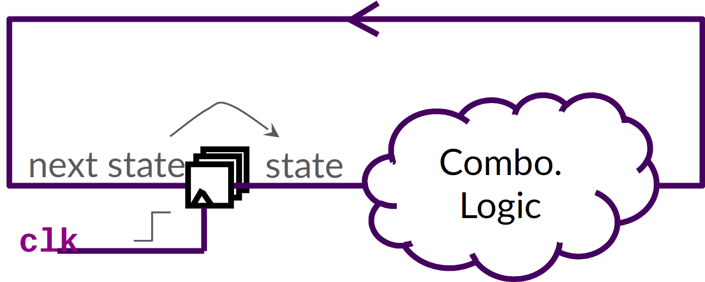

# Building a RISC-V CPU Core

Create a CPU with modern open-source circuit design tools, methodologies, and microarchitecture online.

## Course Description

Details

This mini-workshop is a crash course in digital logic design and basic CPU microarchitecture. Using the Makerchip online integrated development environment (IDE), you’ll implement everything from logic gates to a simple, but complete, RISC-V CPU core. You’ll be amazed by what you can do using freely-available online tools for open-source development. You’ll walk away with fundamental skills for a career in logic design, and you’ll position yourself on the forefront by learning to use the emerging Transaction-Level Verilog language extension (even if you don’t already know Verilog).

## Welcome!

Details

### Welcome to LFD111x!

[Video](videos/BuildingRISCV_Welcome.mp4)

Transcription

1. Hi. My name is Steve Hoover.
1. I’m the founder of a startup called Redwood EDA and your instructor for this course.
1. In this course, you’ll learn digital logic design and CPU microarchitecture.
1. You’ll use register-transfer-level, or RTL, logic to implement a RISC-V CPU core.
1. At Redwood EDA, our focus goes beyond RTL.
1. We focus on advanced modeling using Transaction-Level Verilog, which is a follow-on to the Verilog and SystemVerilog RTL languages.
1. You’ll actually be using Transaction-Level Verilog (or TL-Verilog) in this course.
1. Though Verilog would suffice, it’s actually easiest to learn digital logic using TL-Verilog and you can follow this up by learning the legacy constructs of Verilog and by learning the advanced concepts in TL-Verilog.
1. This course starts very basic with logic gates.
1. You may already have experience with digital logic, and this is fine. Don’t skip ahead.
1. You’ll be presented with these concepts in a new context, and you’ll zip right through them, to get very quickly to TL-Verilog, CPU architecture, and RISC-V.
1. To keep the course self-paced, it is based mostly on written content, so you won’t see much more of me, but I wanted to at least say hello and kick things off in person.
1. So, “hello”; welcome to Building a RISC-V CPU Core. I hope you have a pleasant and informative journey.

## Chapter 1: Learning Platform

Details

### Chapter 1 Overview

### Introduction

This mini-workshop is a crash course in digital logic design and basic CPU microarchitecture. Using the Makerchip online integrated development environment (IDE), you will implement everything from logic gates to a simple, but complete, RISC-V CPU core. You will be amazed by what you can do using freely-available online tools for open-source development. You will walk away with fundamental skills for a career in logic design, and you will position yourself on the forefront by learning to use the emerging Transaction-Level Verilog language extension (even if you don’t already know Verilog).

#### Learning Objectives:

In this chapter, you will be introduced to the course and its learning platform. You will:

- Understand the resources available to you for completing this course.
- Familiarize yourself with the learning platform: Makerchip.com.
- Familiarize yourself with the structure of the course.

#### Course Resources

Before getting started, open this GitHub repository containing external resources for this course, and read the “Welcome” section. Any relevant changes to the technology you will use in this course will be described there. You should bookmark this page or keep it open throughout the course.

#### Makerchip IDE

[Video](videos/BuildingRISCV_MakerchipIntro.mp4)

Transcription

1. Alright! Let me take you now to makerchip.com.
1. And I'll open up the integrated development environment by clicking here.
1. Makerchip is an evolving platform, so it's possible that it may look different for you.
1. I'll open an example so we have something to look at.
1. You'll find various examples here, along with a number of tutorials that you should feel free to run through anytime, to either reinforce a concept you're having trouble with,
1. or to go beyond what we cover in this course.
1. I'll open up this long division example. This circuit performs division similar to how you would do long division on paper.
1. I'm not going to focus on the circuit, but rather on the features of Makerchip.
1. The long division design is now in our editor pane, where we can edit our circuit model.
1. This is written in transaction level Verilog; compilation happened automatically when I opened the example.
1. But we would compile our design from this e-menu or using Control + Enter.
1. I'll recompile and you'll see spinners on the tabs while the model is compiling and simulating.
1. We can see the log output in the log tab.
1. It's important to always check your logs first every time you compile and fix any errors and unexpected warnings.
1. Many errors are non-fatal and you'll still be able to compile and simulate,
1. but it's much easier to debug errors from the log than to debug your simulation.
1. I'm going to split panes and place the log tab down, here so I can always keep an eye on it.
1. So, we've now got a logic diagram of our circuit here and simulation has generated waveforms, which show us the values on all the signals essentially the wires in our circuit for the duration of the circuit simulation.
1. I'm going to again split panes so I can see the waveform and the logic diagram at the same time.
1. Let me put the waveforms down here.
1. These various views are linked. We can click this signal here, for example, and it will highlight in the circuit diagram.
1. It also highlights in this NAV TLV tab. This tab shows our code similar to the editor, but this is a representation of our code as interpreted by the tools.
1. You'll use this version of your code to debug your designs.
1. Errors and warnings will be highlighted in this code, corresponding to some of the errors you'll see in the logs.
1. So, the general debug flow is to use your waveform to track down incorrect simulation behavior,
1. and then you'll trace the signal back through the logic diagram and code and fix the issue.
1. Note that you can hover over logic in the diagram to see the logic expressions.
1. Also note that you can jump from a NAV TLV line to the editor by clicking on the line number.
1. So, you can track from the incorrect simulation behavior back to the faulty source code.
1. There's also a VIZ tab, which will further simplify debug for large designs.
1. We'll talk about that one later.
1. We'll take a look at a few other things in the IDE later as well, but this is everything you'll need to get started.

#### Labs

Throughout this course, "👉" is used to denote a step you must perform (generally within Makerchip). This course is also available within the EdX platform, where checkboxes are available to help you track progress. Since checkboxes are not available here, but sure to track your progress carefully without missing any step to avoid unnecessary complication.

#### Lab: Introduction to Makerchip

This first lab simply gives you a chance to play with the features of the Makerchip IDE. Your challenge is simply to reproduce the screenshot below (or close to it).

To reproduce the above screenshot, complete the following steps. (Or, if the features of Makerchip have changed, find similar steps to follow by exploring on your own.)

👉 Open the “Validity Tutorial”.

👉 Click “Load Pythagorean Example”.

👉 Split panes and move tabs between panes.

👉 Zoom/pan in Diagram with the mouse wheel and drag.

👉 Zoom Waveform w/ “Zoom In” button.

👉 Click `$bb_sq` to highlight.

#### Lab: Solution

In case you had trouble, here’s a screen capture of this lab.

> [Solution Video](videos/BuildingRISCV_MakerchipIntro.mp4) (no audio)

### Knowledge Check

1. Compilation errors can be seen in Makerchip (as of the video recording) in which two tabs (select all that apply):

    A) EDITOR\
    B) LOG\
    C) NAV-TLV\
    D) DIAGRAM\
    E) WAVEFORM

1. Signals can be selected and highlighted by clicking on them in which tabs (as of the video recording) (select all that apply):

    A) EDITOR\
    B) LOG\
    C) NAV-TLV\
    D) DIAGRAM\
    E) WAVEFORM

Answers

1. B,C
1. C,D,E

## Chapter 2: Digital Logic

Details

### Chapter 2 Overview

#### Introduction

This chapter provides an opportunity to explore basic circuits within the Makerchip iDE. It establishes a baseline understanding of the fundamental principles of digital logic design, and how to design digital logic using TL-Verilog and the Makerchip IDE.

#### Learning Objectives:

By the end of this chapter, you should:

- Be familiar with basic logic gates.
- Be comfortable composing logic gates into higher-order combinational logic functions, including multiplexers and arithmetic circuits.
- Understand the TL-Verilog language syntax for expressing combinational and arithmetic logic functions.
- Comprehend sequential logic and how to express sequential logic in TL-Verilog.
- Have gained experience debugging combinational circuits in Makerchip, including the use of Visual Debug capabilities, unique to the Makerchip platform.

### Combinational Logic

#### Concept: Logic Gates

If you are already familiar with logic gates feel free to skip this “Concept”.

In digital circuits, wires stabilize to one of two voltages: a high voltage (VDD) or a low voltage (VSS or ground). So, a wire carries a boolean value, where high and low voltages can be viewed as 1/0, true/false, asserted/deasserted, on/off, etc. This provides an important abstraction for composing higher-order logic functions with predictable behavior.

Logic gates are the basic building blocks for implementing logic functions. The table below shows basic logic gates. Their function is defined by the “truth tables”, which show, for each combination of input values (A & B), what the output value (X) will be. Be sure to understand the behavior of each gate.

**Table: Logic gates**

Note:

- **AND** and **OR** gates follow their English meanings.
- The small circle (or “bubble”) on the output of some gates indicates an inverted output.
- XOR and **XNOR** are “exclusive” **OR** and **NOR**, where “exclusive” means “but not both”.

Logic gates can be composed to generate higher-order logic functions, as in the circuit below. (This happens to be a circuit known as a “full adder”.)

Figure: Full adder circuit

For a given set of input values, such as the ones depicted below, we will get a given set of output values.

Figure: Example of boolean value propagation through gates

#### Lab: Inverter

Let’s try coding an inverter (a **NOT** gate) in Makerchip. Carefully perform each step below.

👉 Reload the Makerchip IDE to begin with the default code template. (You could also use **Ctrl-Z** in the Editor to restore to the default template or load the default template from the Examples page.)
The first line of the source file specifies the TL-Verilog language version. If it is other than “1d”, it may be necessary to revert the language version to be consistent with this course. In this case, check the GitHub repository for guidance.

👉 In place of `//...`, type `$out = ! $in1;`. (Be sure to preserve the 3-spaces of indentation, similar to the surrounding expressions.) This is an inverter.

👉 Compile and simulate (under Editor’s “E” menu, or **Ctrl-Enter**). If any red X’s appear on the tabs (vs. green checkmarks), make sure you followed the instructions properly and try to resolve the issue. Use the LOG to debug if necessary, or use the video below in times of desperation.

Exploring the results, we make a few key observations.

- Unlike Verilog, there was no need to declare your signals (wires) (`$out` and `$in1`). In TL-Verilog, your assignment statement acts as the declaration of its output signal(s).
- This circuit has a dangling input signal and a dangling output signal. (It also probably has a dangling `$reset` signal that was provided in the template.) These result in non-fatal warning/error conditions. They are reported, but they do not prevent simulation.

Now:

👉 Observe the non-fatal errors in the LOG and in the corresponding mouse-over pop-ups in NAV-TLV.

> **_NOTE_**: There was no need to write a test bench to provide stimulus (input) to your inverter. Makerchip provides random stimulus for dangling inputs. As your designs mature, you’ll want to avoid dangling signals and provide more-targeted stimulus, but, while your code is under development, automatic stimulus can be a real convenience.

👉 See in the WAVEFORM that the inverter’s output is indeed the inverse of its input.

👉 Find the logic expression for your inverter in the DIAGRAM in a mouse-over pop-up. Select the expression in the DIAGRAM and observe the highlighting in other panes.

#### Lab: Solution

In case you had trouble, here’s a screen capture of this lab.

> [Solution Video](videos/LF-BuildingRISCV_Solution2_Inverter.mp4) (no audio)

#### TL-Verilog Syntax: Philosophy

TL-Verilog defines syntax very rigidly. This can be a source of annoyance for newcomers with their own coding style preferences. But this rigidity has an important benefit. In industry code is touched by many hands from many teams, and this rigidity enforces consistency. The TL-Verilog Syntax Specification can be found from the Makerchip “Help” menu, but we will cover the necessary points as we go.

#### TL-Verilog Syntax: Boolean Logic Expressions

Boolean logic has taken on various notations in different fields of study. The following chart shows some of these mathematical notations as well as TL-Verilog operators (which are the same as Verilog) for basic logic gates.

**Table: Boolean Logic Syntaxes**

You can use parentheses to group expressions to form more complex logic functions. If a statement is extended to multiple lines, these lines must have greater indentation than the first line. Statements must always end with a semicolon. Always have a space before and after the “=”. For example:

	 $foo = (  $val1 &&   $val2) ||
	        (! $val1 && ! $val2);

#### TL-Verilog Syntax: Indentation

In TL-Verilog (within \TLV code blocks), indentation and whitespace are meaningful. Tabs (which have no consistently-defined behavior) are not permitted. Each level of indentation is 3 spaces (and the Makerchip editor helps with this).

#### TL-Verilog Syntax: Signal Names

As long as you stick with the suggested signal names throughout this course, you won’t have any trouble, but, for those who might wish to veer off from the script a bit, TL-Verilog is picky about signal names too. While languages typically leave choices like camel-case vs. underscore delimitation up to coding conventions, TL-Verilog enforces these choices.

Naming restrictions serve several purposes:

- They enforce consistency.
- They distinguish types.
- As TL-Verilog is processed into Verilog, auto-generated logic can use Verilog signal names that cannot conflict with those named by the coder.

Specifically, TL-Verilog signal names:

- are prefixed with “$”.
- are composed of tokens delimited by underscores where each token is a string of lower-case characters followed by zero or more digits
- begin with at least two alphabetic (lower-case) characters.

So, for example, these are legal signal names:

- `$my_sig`
- `$val1`

And these are not:

- `$a`
- `$Sig` (this is actually a “state signal”, which we will not use in this course).
- `$val_1`

> **_Note:_** You may elsewhere see the term “pipesignal” referring to these TL-Verilog signals. The distinction between Verilog signals and TL-Verilog pipesignals is not relevant in this course, and we will simply use the short-hand term “signals” throughout.

#### Lab: Logic Gates

Figure: Full adder circuit for reference

As you did with the inverter, try other single-gate logic expressions.
If you are new to hardware description languages (HDLs), try coding the full adder circuit as depicted above. Try it first with each logic gate as a separate statement, then try combining the three gates producing `$carry_out` into a single statement with parentheses to group subexpressions.

#### Lab: Solution

In case you had trouble, here’s a screen capture of this lab.

> [Solution Video](videos/LF-BuildingRISCV_Solution3_FullAdder.mp4) (no audio)

### Arithmetic Logic

#### Arithmetic Logic: Concept

If you have prior experience with hardware description languages (HDLs), and are comfortable with binary and hexadecimal, you can safely skip this “Concept”.

While individual wires (or “bits”) hold one of two values in a digital circuit, we can have a collection of N wires (called a “vector”) that represent up to 2^N possible values.

We are all used to representing numbers in base ten, or decimal. In decimal, we use ten digits, 0-9, and when we count past the last available digit, 9, we wrap back to 0 and increment the next place value, which is worth ten. Base ten, unfortunately, is very awkward for digital logic. Base two or any power of two (4, 8, 16) is much more natural. In base two, or binary, we have digits 0 and 1. Each digit can be represented by a bit. Base sixteen, or hexadecimal, is also very common. In hexadecimal the digits are 0-9 and A-F (for ten through fifteen). A single hexadecimal digit can be represented by four bits. The table below shows values zero through twenty in decimal, binary, and hexadecimal.

**Table: Decimal, binary, and hexadecimal number systems**

| Decimal (base 10) | Binary (base 2) | Hexadecimal (base 16) |
| ----------------- | ---------------- | ---------------------- |
| 00                | 00000            | 00                     |
| 01                | 00001            | 01                     |
| 02                | 00010            | 02                     |
| 03                | 00011            | 03                     |
| 04                | 00100            | 04                     |
| 05                | 00101            | 05                     |
| 06                | 00110            | 06                     |
| 07                | 00111            | 07                     |
| 08                | 01000            | 08                     |
| 09                | 01001            | 09                     |
| 10                | 01010            | 0A                     |
| 11                | 01011            | 0B                     |
| 12                | 01100            | 0C                     |
| 13                | 01101            | 0D                     |
| 14                | 01110            | 0E                     |
| 15                | 01111            | 0F                     |
| 16                | 10000            | 10                     |
| 17                | 10001            | 11                     |
| 18                | 10010            | 12                     |
| 19                | 10011            | 13                     |
| 20                | 10100            | 14                     |

HDLs support “vector” signals that hold multiple bits. Vectors can be used to represent binary-encoded (signed or unsigned) integer values. For example, a 5-bit vector could hold the value 13 as bit values 01101. HDLs support arithmetic operations, such as addition, that operate on these bit vector values.

#### Arithmetic Logic: TL-Verilog Syntax

In TL-Verilog, the most common data types are booleans (as you used in the previous lab) and bit vectors. A vector is declared by providing a bit range in its assignment as so:

    $vect[7:0] = ....;

Bit ranges are generally not required on the right-hand side of an expression. When they are used, they extract a subrange of bits from a vector signal.

In Verilog and TL-Verilog, arithmetic operators, like +, -, *, /, and % (modulo) can be used on vectors. Without these operators, an adder circuit would have to be constructed by replicating the full adder circuit we looked at earlier for each bit position in the adder to create the “ripple-carry adder” circuit depicted below.

Figure: Ripple-carry adder circuit composed of full adders

Other vector operators are supported including comparison operators like ==, !=, >, >=, <, <=. We will only cover the operators needed for this course.

#### Lab: Arithmetic operators

Starting again from the default template or first deleting your previous logic, now try some arithmetic expressions.

> **_Note:_** As with our earlier examples, you will, as a convenience not bother to declare the input vectors. As such, there is no definition of their width. In this circumstance, you can define their widths by using bit ranges on the right-hand side as such: `$out[7:0] = $in1[6:0] + $in2[6:0];`

> **_Note:_** Values of vector signals are represented in the waveform viewer in hexadecimal. There are many online conversion tools, such as RapidTables if you need help finding a decimal or binary equivalent.

This lab is a simple one:

👉 Code various arithmetic expressions and comparisons to become comfortable with their use.

#### Lab: Solution

In case you had trouble, here’s a screen capture of this lab.

> [Solution Video](videos/LF-BuildingRISCV_Solution4_Arithmetic.mp4) (no audio)

### Multiplexers

#### Multiplexers: Concept

If you are familiar with multiplexers, you may safely skip this “Concept”.

One of the most important logic functions is a multiplexer (or MUX), depicted below.

Figure: A two-way single-bit multiplexer with one-bit (encoded) select

A multiplexer selects between two or more inputs (which can be binary values, vectors, or any other data type). The select line(s) identify the input to drive to the output. Most often the select will be either a binary-encoded input index or a “one-hot” vector in which each bit of the vector corresponds to an input. One and only one of the bits will be asserted to select the corresponding input value.

The MUX depicted above can be constructed from basic logic gates as below. We might read this implementation as “assert the output if `X1` is asserted and selected (by `S == 1`) OR `X2` is asserted and selected (by `S == 0`)”.

Figure: Gate-level implementation of a multiplexer

### Multiplexers: TL-Verilog Syntax

Verilog provides no less than six reasonable syntaxes for coding a MUX, each with pros and cons. TL-Verilog favors the use of the ternary (`?` `:`) operator, and we will stick with this throughout the course. In its simplest form, the ternary operator is:

    $out = $sel ? $in1 : $in0;

This can be read, “`$out` is: if `$sel` then `$in1` otherwise `$in0`.”

The ternary operator can be chained to implement MUXes with more than two input values from which to select. And these inputs can be vectors. We will use very specific code formatting for consistency, illustrated below for a four-way, 8-bit wide MUX with a one-hot select. (Here, `$in0`-`$in3` must be 8-bit vectors.)

    $out[7:0] =
       $sel[3]
          ? $in3 :
       $sel[2]
          ? $in2 :
       $sel[1]
          ? $in1 :
       //default
          $in0;

This expression prioritizes top-to-bottom. So if `$sel[3]` is asserted, `$in3` will be driven on the output regardless of the other `$sel` bits. Its literal interpretation is depicted below, along with its single-gate representation (which is ambiguous about the priority).

Figure: A four-input multiplexer, represented as a chain of two-input multiplexers and as a single gate

#### Lab: Calculator

Next, you’ll try coding the circuit below. This circuit implements a calculator that can perform +, -, *, or / on two input values.

Figure: Combinational calculator circuit

Note that this circuit uses an encoded (aka binary) select, where two `$op[1:0]` bits select from four possible MUX inputs. `$op` can be decoded by using expressions like `$op[1:0] == 2` to select `$prod`, for example.

👉 Since we wouldn’t want you to lose your work, use the "Project" menu to save your work to a local file or to the Makerchip server. The status text in the upper right will confirm that your file is auto-saving.

👉 Code the circuit by providing an expression for each of the signals named in the diagram (other than inputs). Be sure to use the exact names shown and the exact select encodings shown on the MUX inputs. This will be important later.

👉 Be sure your LOG contains only expected errors/warnings about dangling signals.

👉 Inspect the circuit diagram to make sure it looks right. (Don’t worry about the waveforms just yet, we’ll debug this circuit in the next two labs.)

#### Lab: Solution

In case you had trouble, here’s a screen capture of this lab.

> [Solution Video](videos/LF-BuildingRISCV_Solution5_ComboCalculator.mp4) (no audio)

### Literals and Concatenation

#### Liberals

If you are familiar with Verilog expression syntax, you may safely skip this “Concept and Syntax”.

This expression:

    $foo[7:0] = 6;

Defines `$foo` to hold a constant value of 6. In this case the 6 is coerced to eight bits by the assignment. Often it is necessary to be explicit about the width of a literal:

    $foo[7:0] = 8'd6;

explicitly assigns `$foo` to an 8-bit decimal (“d”) value of 6. (To be clear, the”’” is the single-quote character.) Equivalently, we could have written:

    $foo[7:0] = 8'b110;   // 8-bit binary six

or

    $foo[7:0] = 8'h6;   // 8-bit hexadecimal six

#### Concatenation

Concatenation of bit vectors is simply the combining of two bit vectors one after the other to form a wider bit vector. The syntax is clear from this example:

    $word[15:0] = {$upper_byte, $lower_byte};

#### Lab: Calculator Stimulus

Your calculator circuit is driven with random 32-bit inputs. You may have observed that the computation often underflows or overflows, meaning the correct result value would be too large (> 2^32) or too small (< 0) to express in the 32-bit `$out` signal.

It will be easier to visually verify the simulation behavior if we use smaller input values. So let’s randomize only the lower bits of `$val1` and `$val2`. To reduce the chance of underflow, let’s use a smaller value for `$val2` than `$val1`.

👉 Return to your calculator project.

👉 Assign `$val1` such that its upper 26 bits are zero and its remaining 6 bits are random. To do so, you’ll use a literal and a concatenation. For the random bits use a new unassigned signal, `$val1_rand[5:0]`.

👉 Assign `$val2` similarly, but randomizing only the lower 4 bits.

The default code template you started with in Makerchip compiles without strict bit-width checking. Let’s enable strict checking to make sure you got this right.

👉 Below `m4_makerchip_module`, add this on its own line: `/* verilator lint_on WIDTH */`. and **Ctrl-Enter** to compile and simulate. Debug LOG messages as necessary.

👉 Now, it should be easier to understand the waveforms, so visually verify the operation of your calculator. Verify that it saved (message in upper right).

#### Lab: Solution

In case you had trouble, here’s a screen capture of this lab.

> [Solution Video](videos/LF-BuildingRISCV_Solution6_CalcStimulus.mp4) (no audio)

### Visual Debug

#### Lab: Visual Debug

Waveform viewers have been the standard debug tool for circuit design since dinosaurs roamed the earth. But Makerchip supports a better debug methodology as well. We’ve prepared some custom visualization to help with the debug of your calculator. As always, check the box for each step when done, to ensure you perform all required steps.

To include this visualization:

👉 Paste this single line below the `m4_makerchip_module` line to include the visualization library:

    `m4_include_lib(['https://raw.githubusercontent.com/stevehoover/LF-Building-a-RISC-V-CPU-Core/main/lib/calc_viz.tlv'])`.

It may be necessary to correct the single-quote characters by retyping them after cut-and-pasting.

👉 Add this line as the last line in the `\TLV` region: `m4+calc_viz()` to instantiate the visualization. **Ctrl-Enter**.

👉 You should now see a calculator in the VIZ pane. If necessary, debug the LOG. In NAV-TLV the `m4_include_lib` line should have turned into a comment, and the `m4+calc_viz()` macro instantiation should have expanded to a block of `\viz_js` code.

👉 Lay out your IDE so you can see both VIZ and WAVEFORM. Step through VIZ to see the operations performed by your calculator. Note that your calculator, like the waveform, is showing values in hexadecimal. Relate what you see in VIZ to what you see in the waveform. If you notice incorrect behavior, debug it by isolating the faulty logic and fixing it.

👉 Be sure your work is saved.

Typically, you would create your own custom visualizations as you develop your circuit, so you can see the big picture simulation behavior more easily. In this course, you will focus on the hardware logic, and we provide visualization for you. If you are curious, though, you can see the visualization code in the NAV-TLV pane, where macros are expanded.

#### Lab: Solution

In case you had trouble, here’s a screen capture of this lab.

> [Solution Video](videos/LF-BuildingRISCV_Solution7_CalcVIZ.mp4) (no audio)

### File Structure and Tool Flow

#### Concepts

This “File Structure and Tool Flow” topic is entirely optional. It describes the TL-Verilog file structure used within Makerchip and the motivations for it. It describes the use of the M4 macro preprocessor and other aspects of the tool flow used behind the scenes when you compile and simulate. Feel free to skip over it, but we know some of you will be curious, especially those who have experience with Verilog.

> **_Alert:_** To get more insight on this topic, you can EITHER follow the self-guided tour on this page, OR you can watch the video exploring this topic in a bit more detail on the next page.

##### Use the video:

[Video](videos/BuildingRISCV_Compilation.mp4)

Transcription

1. Okay. So, back now again, inside Makerchip.
1. Let me talk a little bit about the compilation and simulation flow that happens behind the scenes.
1. Under the Help menu, there's a Help page that describes some of the controls available inside of Makerchip and then talks about this compilation and simulation flow.
1. So, when you compile from the editor, your code gets sent to the Makerchip server.
1. The first thing that happens to your code is it gets processed by an open source macro preprocessor, that's been around for ages, called m4.
1. And really, the use of this macro pre-processing is a temporary measure while we explore features of Transaction Level Verilog.
1. Transaction Level Verilog is a fairly new language it's evolving and macro pre-processing gives us a way to explore language capabilities before we sort of harden them in the language spec.
1. So, m4 is currently used for modularity and reuse, it allows us to define macros of TL Verilog logic that we can then instantiate,
1. it gives us a parameterization of those modules, it gives us the ability to define constants, and it gives us the ability to programmatically generate TL Verilog logic.
1. After m4 pre-processing, we have what I guess we'll call a clean TL Verilog file that gets sent to SandPiper, at least in our case,
1. so, SandPiper is Redwood EDA's tool for processing TL Verilog logic into Verilog or (System)Verilog.
1. SandPiper is also producing the views that you see inside of Makerchip.
1. So, the Navigable TL Verilog, the logic diagram which is produced using another open source tool called Graphviz,
1. and it's also producing this view that we'll look at shortly that shows us how the TL Verilog logic is turned into Verilog.
1. So, out of SandPiper, we have Verilog or (System)Verilog code that we send now to another open source tool called Verilater.
1. Verilator is compiling and simulating your model.
1. So, Verilator builds a C++ simulator out of your model,
1. and the simulation then produces trace data which is represented by the waveform viewer.
1. Also, not represented here is VIZ. VIZ is a newer feature in Makerchip and
1. so Sandpiper is passing along the visualization code back to the frontend and the visualization code is accessing the trace data just like the waveform viewer to represent the visualizations.
1. All of these steps are producing log output, which is also captured,
1. and if we take a look at that log, the first portion of the log here in blue is from SandPiper,
1. and then the portion here in black is from Verilator.
1. So this is both Verilator compilation, as well as Verilator simulation.
1. And in the case of this empty model, the simulation is not producing any output, and then we get our PASSED or FAILED message.
1. We'll talk about where that comes from shortly.
1. Alright. So, let's talk about that pane I promised we would talk about.
1. Actually, let me load something a little bit more interesting before we look at that.
1. So, just so we have some TL Verolog code to look at, but from the editor under the e-menu, "Show Verilog" opens up this pane, this tab, sorry, this view here
1. and this view is representing for us how your TL Verilog logic is compiled by SandPiper into Verilog code.
1. So, we see here on the bottom left your TL Verilog logic that you would also see in the NAV TLV tab.
1. This code is turned into translated Verilog code to the right of it, and you can see the code, that's the Verilog code is line for line with the original TL Verilog code.
1. That is a really nice property actually when you have errors on your Verilog code. Your Verilog-based tool stack likely has no understanding of the TL Verilog source so it's going to report errors and conditions against your Verilog code.
1. This line for line property means that all of those conditions that are reported against your Verilog apply to your TL Verilog logic as well.
1. In addition to that translated code you have, above it, the generated code. So, this is things like
1. signal declarations, flip-flops. These are for the most part correct by construction.
1. So, these are your flip-flops in green, this is signals that are unassigned, this is the random stimulus provided for them, and then at the bottom, we've got some declarations that are used for tracing your TL Verilog signals.
1. Alright. So dropping out of that and back to Makerchip.
1. So, let's just look here at the structure now of a TL Verilog file. So, your TL Verilog file
1. and for this, let me revert back to the starting template and compile that so your TL Verilog file starts off with a version line.
1. This specifies the language version that's used in the remainder of the file. So this file contains TL Verilog logic using TL Verilog 1d syntax.
1. And we're enabling m4 macro preprocessing.
1. This line also contains a link to information about this language, so link to tlx.org.
1. After that, we have a section... I should say a region of (System)Verilog code.
1. So this code is just passed through by SandPiper, and if we look at the NAV TLV, we can see the macro expansion
1. of this m4 macro, which is providing the standard module interface that's required within Makerchip.
1. So, this is the interface by which your logic communicates with the Makerchip simulation.
1. So Makerchip is providing you with a clock and a reset.
1. It's also providing you with a cycle count just for convenience.
1. And then your logic is able to communicate with the platform by reporting passing or failing status from your simulation. And this, if you assert either of these signals, that will stop simulation,
1. and report PASSED or FAILED. And we can see that in the log we're getting PASSED.
1. After the module definition, so TL Verilog is currently used to define logic within a Verilog module, and the first thing we do in that TL Verilog region
1. is hook up our $reset Verilog signal coming from here
1. to a TL Verilog pipesignal, and in this course, we really don't talk about the distinction between TL Verilog signals and Verilog signals,
1. but TL Verilog signals have a property known as timing abstraction and that's why we're generally hooking up our Verilog signals to TL Verilog signals.
1. Of course, in this course we're only expressing our logic in TL Verilog and you don't have to worry about the connection between Verilog and TL Verilog.
1. This is where your logic would go and then,
1. here we are hooking up the passed and failed signals to communicate that our simulation passed after 40 cycles, in this case.
1. So, there's really no checking here, but this is essentially our test bench to verify that the simulation did the right thing. Here we're just reporting passed after 40 cycles.
1. And then we go back into System Verilog context to end our module and that's that.
1. Alright. So now you can jump back into the written course content and read a little bit about the motivation for this file structure and the evolution of TL Verilog.

##### Or learn without the video:

👉 First, in the IDE’s “Help” menu, select “Help”, and read through this help page.

Your TL-Verilog source file is first processed by the M4 macro preprocessor. This is how we imported and used the calculator visualization. The resulting TL-Verilog file is processed into SystemVerilog or Verilog by Redwood EDA’s SandPiper™ tool. You can see how your code is processed into Verilog by SandPiper by opening “Show Verilog” under the Editor’s “E” menu.

Verilator is an open-source tool used to compile your Verilog code into a C++ simulator. This simulator is run to produce the trace data that you can view in the waveform viewer.

The LOG tab shows output from all these tools. Output from M4 and SandPiper is in blue, and output from Verilator and its resulting simulation are in black.

TL-Verilog features are used to define the logic within a (System)Verilog module. Code comments below explain the parts of a TL-Verilog source file structured for use within Makerchip.

    \m4_TLV_version 1d --bestsv: tl-x.org
       // This version line specifies:
       //   o that macro preprocessing using M4 is enabled
       //   o the language version in use (1d)
       //   o optionally command-line arguments
       //   o a link to docs.
    \SV
       // This region contains SystemVerilog (or Verilog) code.
       // SandPiper passes this code through to the Verilog file without
       // any processing.
       
       m4_makerchip_module
          // This M4 macro expands to a Verilog module definition with
          // an interface that is required by the Makerchip platform.
          // This module interface provides the communication between
          // Makerchip and your design.
          //
          // It includes global clock and reset input signals
          // via this interface and its output signals “passed”
          // and “failed” can be driven to end the simulation with a
          // “Simulation Passed” or “Simulation FAILED” message in the
          // LOG.
          //
          // To see the expansion of this macro, look in the NAV-TLV
          // pane. This macro also provides a random vector that can
          // be used for stimulus and it provides some Verilator
          // configuration.
    \TLV
       // TL-Verilog syntax is enabled in this region to express your
       // logic. In this course, we'll always declare our logic
       // here within the m4_makerchip_module, but you could also
       // put your TLV logic in a separate module with an interface
       // that is yours to define.

       $reset = *reset;
          // In \TLV context, *reset references the (System)Verilog
          // reset signal. Here we simply connect it to a TL-Verilog
          // $reset pipesignal.

       // YOUR LOGIC HERE

       *passed = ...;
       *failed = ...;
          // Assert either of these to end simulation (before Makerchip
          // cycle limit).

    \SV
       // Back to SystemVerilog context to end the module.
       endmodule

#### Motivation

For those curious about the motivation for this file structure, it is necessary to understand the strategy for evolving TL-Verilog from Verilog. The ultimate goal is to eventually introduce a new modeling language philosophically different from Verilog in all respects. This will play out over the next decade or decades. In the meantime, we work toward this incrementally, layering on Verilog as a working starting point, with TL-Verilog as a language extension to Verilog. This layering also provides an essential and incremental migration path. And, as tools mature, it is always possible to fall back on Verilog.

Also noteworthy is the fact that TL-Verilog is really a Verilog implementation of TL-X, a language extension defined to layer atop any HDL to extend it with transaction-level features. So there is a migration path from any supported HDL (and, as of this writing, Verilog is the only one).

By using TL-Verilog syntax only within module definitions, Verilog-based tools that are used to stitch the interconnections between modules can remain blissfully unaware of TL-Verilog. Within the Verilog module, other forms of modularity and hierarchy, particular to TL-Verilog can be employed.

Everything we’ll do in this course will be inside the `\TLV` region, but now you understand how this connects with Verilog-based tools.

> **_Note:_** Everything we do in this course could be done just as well in Verilog, but, by using TL-Verilog, you will be poised for further learning of the true power of transaction-level design.You will be able to follow this course up with others where you will pipeline your design with ease. (Also, the Makerchip DIAGRAM tab only works with TL-Verilog.)

### Sequential Logic

#### Clock and Flip-Flops: Concept

If you are familiar with sequential logic and flip-flops, you can safely skip this concept.

Sequential logic introduces a clock signal.

Figure: Clock waveform

The clock is driven throughout the circuit to “flip-flops” which sequence the logic. Flip-flops come in various flavors, but the simplest and most common type of flip-flop, and the only one we will concern ourselves with, is called a “positive-edge-triggered D-type flip-flop”. These drive the value at their input to their output, but only when the clock rises. They hold their output value until the next rising edge of their clock input.

Figure: A flip-flop

Although there are also flip-flops that act on the falling edge of the clock, our circuits will operate only on the rising edge. Additionally there are flip-flops that incorporate logic functions. Tools can choose to implement our designs using these flip-flops even though we will not be explicit about doing so in our source code. Since we will use only D flip-flops, we will henceforth refer to them simply as flip-flops, or even just “flops”.

#### Sequential Logic Example and Reset

Before getting too theoretical about sequential logic, let’s look at an example. Let’s look at a circuit that computes the Fibonacci sequence. Each number in the Fibonacci sequence is the sum of the previous two numbers: 1, 1, 2, 3, 5, 8, 13, … This circuit will perpetually compute the next number in the sequence:

Figure: Fibonacci circuit (incomplete)

With each rising clock edge, the values will propagate through the flops, shifting one flop to the right, producing this waveform.

Figure: Fibonacci sequence circuit waveforms

This circuit however is incomplete. What’s missing? Reset. We need a way to initialize our circuit with two 1s to begin the sequence.

Unlike a combinational circuit, where output values are purely a function of the input values, sequential circuits have internal state -- the values held by flip-flops. Every sequential circuit needs the ability to get to a known “reset” state. And therefore, every sequential circuit will have a `reset` signal responsible for accomplishing this. The circuit must be designed such that, if `reset` is asserted for many cycles, the logic will stabilize to a known reset state.

The easiest approach to providing a reset capability is to force every flip-flop to a reset value when `reset` is asserted. This methodology is used by some design teams, but if area and power are a concern we can do better.

In our Fibonacci circuit, we only need to reset the first flip-flop.

Figure: Fibonacci series circuit

While `$reset` is asserted, a 1 value is driven into `$num`. The clock continues to toggle during reset, and the 1 value propagates through both flops, resetting them both to a 1 value.

This provides the initial two 1s in the sequence. When `$reset` is deasserted, `$num` takes on a value of 2, and the circuit continues to produce a new value in the sequence in each subsequent clock cycle.

Figure: Fibonacci sequence circuit waveforms

> **_Note:_** It is common for `$reset` to be provided as a negatively asserted signal, perhaps named rstn, meaning reset occurs when rstn is 0, and rstn is 1 during normal operation. Though the motivation for this is rarely relevant with modern logic synthesis tools, you will still commonly see this in practice. We will stick with a positively asserted `$reset`.

> **_Note:_** Often the reset capability is physically incorporated into the flip-flop itself. We will provide our reset logic explicitly. Logic synthesis tools can choose to implement the behavior using a “reset flip-flop”.

#### Sequential Locig: TL-Verilog Syntax

In TL-Verilog, we can reference the previous and previous-previous versions of `$num` as `>>1$num` and `>>2$num`. Unlike RTL, in TL design we need not assign these explicitly. They are implicitly available for use, and the need for flip-flops is implied.

Figure: Fibonacci circuit labeled with staged signal references

So this example can be coded as:

    $num[31:0] = $reset ? 1 : (>>1$num + >>2$num);

#### Concept: Generalization of Sequential Logic

A sequential circuit, containing flops and combinational logic can be viewed as follows.

Figure: Generalized view of a sequential circuit

During each cycle of the clock, the combinational logic evaluates, then the clock rises and next state becomes state, and the process continues.

#### Lab: Counter

Now, you try. Similar to the Fibonacci sequence circuit, you’ll create a 16-bit free running counter, depicted below.

Figure: A counter circuit

`$cnt` resets to zero (`16'b0`) and, after reset, begins incrementing by one (`16'b1`) each cycle.

👉 Reload or reset Makerchip to begin again from the default template.

👉 Confirm that the default template is providing you with a `$reset` signal as:

    $reset = *reset;

👉 Create the single-statement expression for this circuit. When you get the waveform below, you’ve got it right. For reference, this is the expression for the Fibonacci circuit:

    $num[31:0] = $reset ? 1 : (>>1$num + >>2$num);

Figure: Correct waveform for counter circuit lab

#### Lab: Solution

In case you had trouble with the Counter lab, here is a screen capture of the steps you had to perform.

> [Solution Video](videos/LF-BuildingRISCV_Solution8_Counter.mp4) (no audio)

#### Lab: Recirculating Calculator

A real (old-school) calculator displays the result of each calculation. It holds onto this result value and uses it as the first operand in the next computation. If you enter “+ 3” in the calculator, it adds three to the previous result. Let’s update our calculator to act like this. Each cycle, we’ll perform a new calculation, based on the previous result.

This previous result is state. And wherever we have state, we must have a `$reset` that will set that state to a known value. As in a real calculator, we will reset the value to zero.

To recirculate the result (`$out`), and reset it to zero, we would have:

Figure: Logic modifications for this lab to sequentialize the calculator circuit

👉 Return to your combinational calculator project

👉 Assign `$val1[31:0]` to the previous value of `$out` (replacing its old assignment).

👉 Add a `$reset` signal and a new (highest priority) MUX input to reset `$out` to zero.

👉 Visually confirm proper operation in VIZ and WAVEFORM. Note that negative values will be represented with upper bits equal to 1 (so “fff…” in hexadecimal). (You could disable subtraction to prevent negative values.)

👉 You may want to save your work outside of Makerchip.

#### Lab: Solution

In case you had trouble, here’s a screen capture of this lab.

[Solution Video](videos/LF-BuildingRISCV_Solution9_SequentialCalculator.mp4) (no audio)

### Knowledge Check

1. What logic function is created by this TL-Verilog expression: `$out = $sel ? $in1 : $in2;`
An accumulator

    A) A transistor\
    B) A multiplexer\
    C) A precondition

1. A byte value can be declared in TL-Verilog as:

    A) `byte $byte;`\
    B) `bit $byte[7:0];`\
    C) `8'b$byte;`\
    D) `$byte[7:0] = …;`

1. The Verilog literal hexadecimal value expression for a byte with a decimal value of 24 is:

    A) `8'h18`\
    B) `8'ha4`\
    C) `8'h24`\
    D) `8'h40`

1. Sequential logic requires which of the following signals (or similar) (select all that apply):

    A) a clock\
    B) `$next`\
    C) `$reset`\
    D) `$count`

Answers

1. C: A multiplexer
1. D: `$byte[7:0] = …;`
1. A: `8'h18`
1. A,C: a clock, `$reset`

## Chapter 3: The Role of RISC-V

Details

### Introduction and Learning Objectives

#### Introduction

This chapter describes, at a high level, the role played by RISC-V and how it fits into the scene. How does a program get compiled and eventually execute on a RISC-V CPU core?

#### Learning Objectives

By the end of this chapter, you should understand:

- The role of compilers and assemblers.
- The role of an instruction set architecture (ISA).
- General properties of RISC-V versus other ISAs.
- Software, Compilers, and CPUs

#### Software, Compilers, and CPUs

Likely you have experience writing programs in languages like Python, JavaScript, Java, C++, etc. These languages are portable and can run on just about any CPU hardware. CPU’s do not execute these languages directly. They execute raw *machine instructions* that have been encoded into bits as defined by an *instruction set architecture* (ISA). Popular ISAs include x86, ARM, MIPS, RISC-V, etc.

A *compiler* does the job of translating a program’s source code into a *binary file* or *executable* containing machine instructions for a particular ISA. An operating system (and perhaps a runtime environment) does the job of loading the binary file into memory for execution by the CPU hardware that understands the given ISA.

Figure: Software development and execution flow

The binary file is easily interpreted by hardware but not so easily by a human. The ISA defines a human readable form of every instruction as well as the mapping of those human readable *assembly instructions* into bits. In addition to producing binary files, compilers can generate *assembly code*. An assembler can compile the assembly code into a binary file. In addition to providing visibility to compiler output, assembly programs can also be written by hand. This is useful for hardware tests and other situations where direct low-level control is needed. You will use assembly-level test programs in this course to debug your RISC-V design.

Figure: Assembly code development and execution flows

#### RISC-V Overview

In this course, you will build a simple CPU that supports the RISC-V ISA. RISC-V has very rapidly gained popularity due to its open nature--its explicit lack of patent protection and its community focus. Following the lead of RISC-V, MIPS and PowerPC have subsequently gone open as well.

RISC-V is also popular for its simplicity and extensibility, which makes it a great choice for this course. “RISC”, in fact, stands for “reduced instruction set computing” and contrasts with ‘complex instruction set computing” (CISC). RISC-V (pronounced “risk five”) is the fifth in a series of RISC ISAs from UC Berkeley. You will implement the core instructions of the base RISC-V instruction set (RV32I), which contains just 47 instructions. Of these, you will implement 31 (Of the remaining 16, 10 have to do with the surrounding system, and 6 provide support for storing and loading small values to and from memory).

Like other RISC (and even CISC) ISAs, RISC-V is a *load-store architecture*. It contains a register file capable of storing up to 32 values (well, actually 31). Most instructions read from and write back to the register file. Load and store instructions transfer values between memory and the register file.

RISC-V instructions may provide the following fields:

- **opcode:** Provides a general classification of the instruction and determines which of the remaining fields are needed, and how they are laid out, or encoded, in the remaining instruction bits.
- **function field** (funct3/funct7)**:** Specifies the exact function performed by the instruction, if not fully specified by the opcode.
- **rs1/rs2:** The indices (0-31) identifying the register(s) in the register file containing the source operand values on which the instruction operates.
- **rd:** The index (0-31) of the register into which the instruction’s result is written.
- **immediate:** A value contained within the instruction bits themselves. This value may provide an offset for indexing into memory or a value upon which to operate (in place of the register value indexed by rs2).

All instructions are 32 bits. The R-type encoding provides a general layout of the instruction fields used by all instruction types. R-type instructions have no immediate value. Other instruction types use a subset of the R-type fields and provide an immediate value in the remaining bits.

Figure: RISC-V base instruction formats (from the RISC-V specifications)

You’ll learn further details of the ISA as you build your CPU.

### Knowledge Check

1. An assembler produces:

    A) A program\
    B) Assembly code\
    C) A binary file\
    D) A memory image

1. RISC-V is:

    A) A CPU\
    B) An ISA\
    C) A philosophy\
    D) A microarchitecture

1. In a load-store architecture, an arithmetic instruction reads and writes values from and to:

    A) Memory\
    B) A register file\
    C) Either memory or register file

1. Which RISC-V instruction field(s) determine the operation to perform (select two):

    A) opcode\
    B) rs1/rs2\
    C) rd\
    D) immediate\
    E) function

Answers

1. C: A binary file
1. B: An ISA
1. B: A register file
1. A,E: opcode, function

## Chapter 4: RISC-V-Subset CPU

Details

### Chapter 4 Overview

#### Introduction

In this chapter, you will build a subset of your RISC-V CPU core capable of executing a test program that adds numbers from 1 to 9. Subsequently, you will complete the functionality of your core.

#### Learning Objectives

By the end of this chapter, you should be able to:

- Explain the role of the fundamental components of a basic CPU microarchitecture.
- Be experience expressing digital logic using TL-Verilog.
- Develop an appreciation for the debug process within Makerchip, including:
  - the interpretation of messages in the logs
  - use of visual debug to understand the overall behavior of your logic
  - use of the waveform viewer to understand detailed behavior
  - tracing faulty behavior from symptom to cause
- Instantiate pre-existing Verilog and TL-Verilog components.

### CPU Labs Setup

#### Visualization of RISC-V CPU Simulation

This video explains visualization of your CPU simulation that you will utilize throughout this course.

[Visualization Video](videos/BuildingRISCV_RISCVVIZ.mp4)

Transcription

1. Alright. So, in the remainder of this course, you'll be implementing your CPU core
1. And this is the visualization that you'll have available for doing that.
1. And what we're looking at here is, in green here, is the instruction memory. This is where your program is stored.
1. So, the instruction memory is holding on to these binary values that are interpreted as instructions that your machine is going to execute.
1. These instructions will be loaded into your CPU core.
1. So, here we're loading an ADD immediate instruction into our CPU core that's going to produce a value in the register x12.
1. And we can see that value has been written here.
1. So this ADD instruction is adding 0 [zero] from x0 [x zero] to an immediate value provided by the instruction itself, of 10 [ten].
1. You can see that value here in the instruction in binary form, and it's shown here in the Decode logic as a decimal 10.
1. So, we add 10 to 0, we produce a value of 10 in register x12, and we write that into the register file.
1. So, the register file [RF] is holding on to values that our CPU core operates on.
1. If we continue to step, we do another ADD immediate instruction that's writing to x13,
1. and this one's doing 0 [zero] plus 1 [one]. produces a 1 [one],
1. and now we have an ADD instruction again, 1 [one] plus 0 [zero] is 1 [one],
1. and what this program is actually doing, this is the program that you're going to use to initially develop your CPU core and then, after you develop the core, to run this program in chapter four.
1. In chapter five, you'll complete your RISC-V core and execute all instructions.
1. This program is adding values from one to nine, it's summing the values from one to nine,
1. and the first time through, we're processing the value of 1 [one]. I believe that's in register 14, is our running summation, and register 13 here is keeping track of our... actually, I'm not sure, let me check.
1. Yeah, that's right: register 13 is our loop counter.
1. So, we've just executed a branch. I'm going to step backward here to the branch.
1. The branch instruction is taking us back up to the beginning of our loop.
1. And each iteration of our loop is summing the next value in the sequence.
1. So, if I continue executing these instructions, you'll see that the value in x14, register 14, is holding on to this sum. So it's currently adding values one plus two.
1. Now it's going to do plus three to get six, and if I step three more times,
1. plus four to get 10, and then 15,
1. and then 21, and so on.
1. So, we're continuing to iterate in this loop until we've summed all values up to 10. Our 12 is holding on to the value of 10, the constant value of 10, so that we can do I guess 9 iterations of our loop.
1. And the branch instruction compares our loop count with that value of 10.
1. Once we reach 10, the branch less than will no longer branch, it will fall through.
1. So, if I continue to step, we will now fall through the branch meaning continue execution sequentially and complete our program.
1. So, that's the program you're going to start with and we'll talk about all the aspects of the CPU core
1. the instruction memory, the instruction decoder, the register file, in more detail as you implement them.
1. After you implement this subset CPU core that executes this program, you will implement all of the instructions that you'll do in the course
1. and running a different test program that executes each instruction.
1. And at this stage, you've also added the the DMem, the data memory, which we can see now here,
1. and we're executing this program, which is next going to execute a store instruction, which is going to write a value to the memory, and then the load which is going to read that value from the memory.
1. So this is the framework that you're going to be working with, the visualization, certainly as you're developing your CPU core,
1. also this diagram, logic diagram, is going to become increasingly complete,
1. and you'll see, of course, more and more signals in the waveform.
1. Alright. So next, we'll talk about the setup that you're going to start with to get you on your way.

#### Starting-point code

This video will familiarize you with starting-point code that you will be instructed to use later, before you begin coding your CPU.

[Starting-point Code Video](videos/BuildingRISCV_StartingCode.mp4)

Transcription

1. Alright. So here we are in the course GitHub repository that you're already familiar with,
1. and I'm going to take you down to the starting point code. So this is the code that you'll use to get started with the RISC-V labs exercises.
1. And I'm going to Control click on this link to open it in its own tab, and I just want to quickly walk through the code that we're providing for you.
1. Really, the only thing that you need to know here is where to write your code for the lab exercises.
1. That's here. But it's nice to have a little context on what you're given.
1. So just to walk through what's here, this is structured like any TL Verilog file inside Makerchip. It starts off with a version line that specifies the TL Verilog language version of the file. This is 1d.
1. And it specifies that we want to use a macro preprocessor called m4.
1. So, m4 is processing macros such as this one that... this one is grabbing some library content; it's actually grabbing some macro definitions that we're going to use elsewhere.
1. So, we grab some of the content that we're providing; that's providing you with the visualization capabilities, it's providing you with some macros that you'll instantiate for the register file that are down here at the bottom for the register file and the data memory.
1. So, these are macro instantiations. And this is the macro instantiation of the visualization.
1. So these two lines up here are grabbing those definitions.
1. Next is the program that is going to exist in your instruction memory that you're going to be executing in simulation.
1. And this is what you saw in the previous video; so, the same program summing numbers from actually one to nine, not one to ten, and let's see...
1. so basically, through macro pre-processing, we're turning these human-readable instructions into binary that your CPU core is processing.
1. Then we have the module definition that the Makerchip platform expects to see.
1. So this again is a m4 macro instantiation which looking in the NAV TLV, we can see the expansion of that macro.
1. So, we're seeing that that expands to a module definition.
1. That's expected by the Makerchip platform. And the Makerchip platform provides through that interface the clock and the reset to control your logic, it's also giving you a cycle count.
1. And you are able to pass back to the platform a passed and/or a failed signal.
1. And we're doing so here.
1. So here we're telling the platform we're never going to report passed,
1. and we're just going to report fail, always after a fixed number of cycles, and that number of cycles is defined up here to be 50.
1. So after 50 cycles, we're always going to report failure.
1. And as your core gets sufficiently capable, we will add some logic here to define the passed condition and the failed condition.
1. But for most of your coding, you're not going to rely on what's reported in the log. We can see in the log here that we're reporting failure.
1. We're not going to rely on that. Your logic is very dynamic and you'll just use the visualization to understand that each piece of logic that you add is properly reflected in the behavior that you're able to visualize.
1. Alright. So that's where you start. And in the next video I'll introduce you to some reference solutions that we're also making available to you to help you if you get stuck.

#### Reference solutions

This video explains use of the reference solutions provided with this course.

[Reference Solutions Video](videos/BuildingRISCV_ReferenceSolutions.mp4)

Transcription

1. Alright. So back in our GitHub repository. I want to introduce you to the reference solutions.
1. So, I'm going to open those by again Control clicking here to open in its own tab.
1. So, these solutions are provided for you as reference in case you get stuck.
1. You should be able to get through the course just fine on your own following the course instructions,
1. but if for some reason you're stuck on a particular lab, you can't figure out the right syntax, the errors that are reported in the log just don't make sense to you,
1. you can use these reference solutions to get past your hurdle.
1. So these reference solutions are providing you some code, not the solution code. We're not providing you the code in the reference solutions,
1. but we are giving you access to the waveform, the visualization, the diagram, and the log.
1. So the way you use these reference solutions, this same code is providing you solutions for all of the different lab exercises, and you specify which lab exercise you want to see by providing a mnemonic here.
1. So let's say you're working on the lab where you're working on TAKEN_BR [taken branch]. It should be pretty easy from these mnemonics to figure out the correlation with the labs that you're working on .
1. So, if you're working on TAKEN_BR [taken branch], you can enter TAKEN_BR here and compile CTRL-Enter
1. to get the reference solutions.
1. So here's the diagram that you should be getting at this point in the exercises, and you can look around, and here's the TAKEN_BR logic.
1. So, if you can't figure out this logic expression, the syntax, you can consult this here, and figure out the syntax you're supposed to be using.
1. You also, you know, maybe your visualization looks a little weird, you're not quite sure about the behavior that you're seeing, if that's the right behavior or the wrong behavior,
1. you can take a look at the reference solutions and see how the reference solutions are behaving.
1. Again, you've got access to the waveform data, so you can poke around and figure out the behavior
1. or understand the behavior that you're intended to implement if it's not clear from the instructions.
1. And then you'll know what you need to implement.
1. And you also have access to the logs.
1. Alright. So, the actual code itself is hidden both in the editor and in the NAV TLV. You won't see the solution code.
1. Alright. So now you can jump into the written course content, learn about RISK-V, and then start coding your own.

#### Showcasing your work

Now that you are preparing to create something more substantial, it’s worth considering a few options for how you will develop, save, and showcase your design (all of which are optional).

Consider capturing your work in GitHub (or another Git hosting platform). If you are or will be job hunting, your GitHub profile often speaks more strongly to a potential employer than your resume. GitHub is also a great place to snapshot your code as you develop it to be sure you don’t lose your work. You can create a fresh repository for your work, or fork the course repository. You can edit files directly via GitHub’s web interface and paste your code from Makerchip, all within your browser, or you can clone your repository on your local system and paste your code into a text editor.

We also have a convenient option for working with local files on your own desktop, whether in a git repository or not. You can launch Makerchip from your desktop to work with a local TL-Verilog source file. Makerchip runs in your browser but autosaves back to your desktop.

Only if you’d like to try this workflow, first get the starting point code locally by cloning the course GitHub repository.

    git clone https://github.com/stevehoover/LF-Building-a-RISC-V-CPU-Core.git
    # (and enter your credentials)

Then install the Makerchip app:

    pip3 install makerchip-app

#### Opening the Starting-Point Code

Now, open the starting-point code template.

👉 Only if you are using Makerchip app to edit code on your local computer, first copy the code from `LF-Building-a-RISC-V-CPU-Core/risc-v_shell.tlv` to wherever you would like to edit it, then:

    makerchip <path>/risc-v_shell.tlv

👉 Otherwise, simply click this link to open the starting code in your browser, and, once the code loads, “Save as New Project”.

👉 Simulation should run. The LOG should report “Simulation FAILED!!!” (and will until this chapter is successfully completed). VIZ should show the test program and signals that have not yet been implemented. (Mouse-wheel-down or use the “-” button to bring these fully into view.)

Whether you are using the Makerchip app or not, after each lab, quickly check that your work has been properly autosaved to the cloud or to your local system by checking the status bar within Makerchip.

Generally, if you get off track and need to get back to a stable version of your code, **Ctrl-Z** will do the trick, but it might also be wise to save snapshots (or git commits) on occasion.

### CPU Microarchitecture and Implementation Plan

CPUs come in many flavors, from small microcontrollers, optimized for small area and low power, to desktop and server processors, optimized for performance. Within several hours, you’ll construct a CPU core that could be appropriate as a microcontroller. In contrast, a desktop or server CPU chip might be built by a team of hundreds of seasoned engineers over a period of several years.

Our CPU will fully execute one instruction with each new clock cycle. Doing all of this work within a single clock cycle is only possible if the clock is running relatively slowly, which is our assumption.

We’ll start by implementing enough of the CPU to execute our test program. As you add each new piece of functionality, you will see in the VIZ pane the behavior you implemented, with more and more of the test program executing correctly until it is successfully summing numbers from one to nine. Then we’ll go back to implement support for the bulk of the RV32I instruction set.

Let’s look at the components of our CPU, following the flow of an instruction through the logic. This is also roughly the order in which we will implement the logic.

Figure: RISC-V CPU Block Diagram

1. **PC Logic:** This logic is responsible for the program counter (PC). The PC identifies the instruction our CPU will execute next. Most instructions execute sequentially, meaning the default behavior of the PC is to increment to the following instruction each clock cycle. Branch and jump instructions, however, are non-sequential. They specify a target instruction to execute next, and the PC logic must update the PC accordingly.

1. **Fetch:** The instruction memory (IMem) holds the instructions to execute. To read the IMem, or “fetch”, we simply pull out the instruction pointed to by the PC.
Decode Logic: Now that we have an instruction to execute, we must interpret, or decode, it. We must break it into fields based on its type. These fields would tell us which registers to read, which operation to perform, etc.

1. **Register File Read:** The register file is a small local storage of values the program is actively working with. We decoded the instruction to determine which registers we need to operate on. Now, we need to read those registers from the register file.

1. **Arithmetic Logic Unit (ALU):** Now that we have the register values, it’s time to operate on them. This is the job of the ALU. It will add, subtract, multiply, shift, etc, based on the operation specified in the instruction.

1. **Register File Write:** Now the result value from the ALU can be written back to the destination register specified in the instruction.

1. **DMem:** Our test program executes entirely out of the register file and does not require a data memory (DMem). But no CPU is complete without one. The DMem is written to by store instructions and read from by load instructions.

In this course, we are focused on the CPU core only. We are ignoring all of the logic that would be necessary to interface with the surrounding system, such as input/output (I/O) controllers, interrupt logic, system timers, etc.

Notably, we are making simplifying assumptions about memory. A general-purpose CPU would typically have a large memory holding both instructions and data. At any reasonable clock speed, it would take many clock cycles to access memory. Caches would be used to hold recently-accessed memory data close to the CPU core. We are ignoring all of these sources of complexity. We are choosing to implement separate, and very small, instruction and data memories. It is typical to implement separate, single-cycle instruction and data caches, and our IMem and DMem are not unlike such caches.

### PC Logic

#### Implementing PC Logic

Figure: Implementing PC logic

Initially we’ll implement only sequential fetching, so the PC update will be, for now, simply a counter. Note that:

- The PC is a byte address, meaning it references the first byte of an instruction in the IMem. Instructions are 4 bytes long, so, although the PC increment is depicted as “+1” (instruction), the actual increment must be by 4 (bytes). The lowest two PC bits must always be zero in normal operation.
- Instruction fetching should start from address zero, so the first `$pc` value with `$reset` deasserted should be zero, as is implemented in the logic diagram below.
- Unlike our earlier counter circuit, for readability, we use unique names for `$pc` and `$next_pc`, by assigning `$pc` to the previous `$next_pc`.

Figure: Initial PC logic

👉 Implement the circuit above (replacing the “YOUR CODE HERE” comment), and confirm in VIZ and WAVEFORM that the PC is now starting at zero and incrementing as it should.

Remember, you can find reference solutions for all RISC-V labs in the course GitHub repository.
Instruction Memory

### Instruction Memory

#### Implementing Instruction Memory
 

Figure: Implementing instruction memory

We will implement our IMem by instantiating a Verilog macro. This macro accepts a byte address as input, and produces the 32-bit read data as output. The macro can be instantiated, for example, as:

    `READONLY_MEM($addr, $$read_data[31:0])

Verilog macro instantiation is preceded by a back-tick (not to be confused with a single quote).

In expressions like this that do not syntactically differentiate assigned signals from consumed signals, it is necessary to identify assigned signals using a `$$` prefix. And, as always, an assigned signal declares its bit range. Thus `$$read_data[31:0]` is used above.

This macro is simplified in several ways versus what you would typically see for an array macro:

- There is no way to write to our array. The program specified in the template is magically populated into this array for you.
- Typically an array would have a read enable input as well. This read enable would indicate, each cycle, whether to perform a read. Our array will always read, and we are not concerned with the power savings a read enable could offer.
- Typically, a memory structure like our IMem would be implemented using a physical structure called static random access memory, or SRAM. The address would be provided in one clock cycle, and the data would be read out in the next cycle. Our entire CPU, however, will execute within a single clock cycle. Our array provides its output data on the same clock cycle as the input address. Our macro would result in an implementation using flip-flops that would be far less optimal than SRAM.

Figure: Instruction memory hookup

Implement instruction fetch by instantiating IMem with proper connectivity:

👉 Instantiate the `READONLY_MEM macro after your PC logic, providing `$pc` as the address and `$$instr[31:0]` as the output. Be sure to align this with other statements always using three spaces of indentation.

👉 Be sure that: the LOG indicates the dangling `$instr` output, the DIAGRAM looks right, and VIZ shows instructions being read from the IMem. If anything looks wrong, debug using WAVEFORM, and verify that `$instr` no longer appears in the VIZ “To Be Implemented” signals.

### Decode Logic

### Instruction Type Decode Logic

Figure: Implementing decode logic

Now that we have an instruction, let’s figure out what it is. Remember, RISC-V defines various instruction types that define the layout of the fields of the instruction, according to this table from the [RISC-V specifications](https://riscv.org/technical/specifications/):

Figure: Base instruction formats showing instruction fields for each instruction type

Before we can interpret the instruction, we must know its type. This is determined by its opcode, in `$instr[6:0]`. In fact, `$instr[1:0]` must be `2'b11` for valid RV32I instructions. We will assume all instructions to be valid, so we can simply ignore these two bits. The ISA defines the instruction type to be determined as follows.

Figure: Instruction types from opcode[6:2] (instr[6:2])

You'll assign a boolean signal for each instruction type that indicates whether the instruction is of that type. For example, we could decode U-type as:

    $is_u_instr = $instr[6:2] == 5'b00101 ||
                  $instr[6:2] == 5'b01101;

👉 Observe how the binary values in this expression correspond to the two U-type boxes in the table.

SystemVerilog gives us an operator that makes this comparison a little simpler:

    $is_u_instr = $instr[6:2] ==? 5'b0x101;

The `==?` operator above allows some bits to be excluded from the comparison by specifying them as “x” (referred to as don’t-care).

👉 Add this assignment statement to your code and write the remaining 5 statements for I, R, S, B, and J instruction types. (Gray cells can be ignored as these are not used in RV32I.)

👉 Compile and simulate. Review LOGs. The VIZ “Instr. Decode” box should indicate the instruction type now. Debug as needed using the WAVEFORM.

#### Instruction Field Decode Logic

Now, based on the instruction type, we can extract the instruction fields. Most fields always come from the same bits regardless of the instruction type, but only have meaning for certain instruction types. The imm field, an “immediate” value embedded in the instruction itself, is the exception. It is constructed from different bits depending on the instruction type.

Figure: Base instruction formats showing instruction fields for each instruction type (repeated for easy reference)

Let’s start with the simpler, non-immediate fields: `$funct3`, `$rs1`, `$rs2`, `$rd`, `$opcode`. We will not use `$funct7`, so you can skip this field.

👉 Extract these fields, for example: `$rs2[4:0] = $instr[24:20];`

👉 Compile/simulate, check LOG (with warnings for these new dangling signals), and debug. As you add these signals, they should be removed from the “To Be Implemented” list in VIZ.

👉 Determine when these fields are valid (excluding `$opcode`, which is always valid). For example:

    $rs2_valid = $is_r_instr || $is_s_instr || $is_b_instr;

Provide `$imm_valid` as well, asserting for all types but R, even though we haven’t determined `$imm` yet.

👉 Compile/simulate, check LOG (now rather lengthy) and debug. Your “To Be Implemented” signals list should be getting shorter.

👉 All this clutter in our LOG is getting annoying. Suppress these warnings using the following:

    `BOGUS_USE($rd $rd_valid $rs1 $rs1_valid ...)

This produces no logic, but looks like a signal consumption, so warnings are suppressed. Note that there are no commas between signals. Also note that if you extend this expression to a second line, this second line must be indented with spaces relative to the first. This line could be removed after signals are used, though some of these signals will only be used for VIZ and will remain unconsumed by your logic.

👉 Compile/simulate and confirm that the LOG is now clean. You should now see register indices in VIZ (in the blue portion of instruction decode). Confirm that they seem correct, and debug if necessary.

The immediate value is a bit more complicated. It is composed of bits from different fields depending on the type.

Figure: Formation of the immediate value based on instruction type

The immediate value for I-type instructions, for example is formed from 21 copies of instruction bit 31, followed by inst[30:20] (which is broken into three fields above for consistency with other formats).

The immediate field can be formed, based on this table using a logic expression like the following. It uses a combination of bit extraction (e.g. `$instr[30:20]`), bit replication (e.g. `{21{…}}`), and bit concatenation (e.g. `{…, …}`):

    $imm[31:0] = $is_i_instr ? {  {21{$instr[31]}},  $instr[30:20]  } :
                 $is_s_instr ? {...} :
                 ...
                               32'b0;  // Default

Complete the above logic expression for `$imm`.
Verify in WAVEFORM and VIZ that the value of `$imm` corresponds to the instructions in the test program. This will test your understanding of binary, decimal and hexadecimal. For example, the `ADDI, x12, x10, 1010` instruction shows the immediate value in binary, VIZ should represent the value in decimal as `i[10]`, and WAVEFORM should show a hexadecimal `a`.

#### Decode Logic: Instruction

Now we need to determine the specific instruction. This is determined from the opcode, instr[30], and funct3 fields as follows. Note that instr[30] is `$funct7[5]` for R-type, or `$imm[10]` for I-type and is labeled “funct7[5]” in the table below:

Figure: Instruction decode table, with needed instructions circled

👉 For convenience, concatenate the relevant fields into a single bit vector signal, as: `$dec_bits[10:0] = {$instr[30],$funct3,$opcode};`

👉 For each of the instructions circled in red (we’ll come back and do the rest later), determine if `$dec_bits` identifies this instruction. For example:

    $is_beq = $dec_bits ==? 11'bx_000_1100011;

Note that underscores here are optional to help delimit fields. Also note, we’re using “x” as a don’t-care for the instr[30] bit, which is not used by BEQ (or any other instruction in the left column).

👉 Compile and simulate. Again, there will be many warnings for these unused signals. It is worthwhile to again use `BOGUS_USE to keep the LOG clean.

👉 Confirm that VIZ is now displaying the correct instruction mnemonics in the blue section of “Instr. Decode”. Debug as needed.

### Register File Read

#### Implementing Register File Read

Figure: Implementing register file read

Like our mini IMem, the register file is a pretty typical array structure, so we can find a library component for it. This time, rather than using a Verilog module or macro as we did for IMem, we will use a TL-Verilog array definition, expanded by the M4 macro preprocessor.

Near the bottom of your code, and commented out, you’ll find the following example instantiation of a register file (RF) macro.

    //m4+rf(32, 32, $reset, $wr_en, $wr_index[4:0], $wr_data[31:0], $rd1_en, $rd1_index[4:0], $rd1_data, $rd2_en, $rd2_index[4:0], $rd2_data)

This would instantiate a 32-entry, 32-bit-wide register file connected to the given input and output signals, as depicted below. Each of the two read ports requires an index to read from and an enable signal that must assert when a read is required, and it produces read data as output (on the same cycle).

Figure: The provided register file instantiation (before you modify it)

For example, to read register 5 (x5) and register 8 (x8), `$rd_en1` and `$rd_en2` would both be asserted, and `$rd_index1` and `$rd_index2` would be driven with 5 and 8.

A few things to note:

- For this macro, output signal arguments are signal names. Inputs are expressions.
- We are using “rd” as an abbreviation for read, which is easily confused with the destination register to be written by an instruction which is also referred to in RISC-V as “rd”.

You will modify the macro arguments related to register read to properly read instructions’ source register values.

👉 Uncomment the rf instantiation. (Noting that M4 macros are an experimental construct, this macro instantiation must remain on a (very long) single line. Also, keep it where it is, near the bottom of the file so it’s expansion does not clutter NAV-TLV.)

👉 Though you have not connected the macro properly yet, compile and simulate this, and feel free to explore the results with dangling signals. You’ll see in NAV-TLV the expansion of this macro. Don’t worry about the code; it uses syntax we haven’t introduced, but you will see warnings/errors highlighted over the dangling input/output signals. As you connect this in the following steps, these warnings will be eliminated. You’ll see messages in the LOG as well, and there will be disconnects in the DIAGRAM. You’ll see the register file in VIZ as well, though its behavior will be random until its inputs are properly connected.

Your instruction decode logic provides the signals needed for register file read. It determines, based on the instruction type, whether source registers are needed.. It extracts the rs1 and rs2 fields which provide the indices for these registers if valid.

👉 Modify the appropriate RF macro arguments to connect the decode output signals to the register file read input signals to read the correct registers when they are needed.

👉 Connect the output read data to new signals named `$src1_value` and `$src2_value` by replacing the appropriate macro arguments with these new signal names. (Bit ranges are not needed as they are explicit within the macro definition.)

👉 Compile/simulate. Observe that the register value in each entry of the register file is equal to the entry index. A more typical choice would have been to initialize all values to zero. We’ve provided non-zero initial values to simplify the next step.

👉 Confirm proper operation in VIZ by observing the source register being read from the RF. Save your work outside of Makerchip.

### Arithmetic Logic Unit

#### Implementing the Arithmetic Logic Unit

Figure: Implementing the arithmetic logic unit

Now, you have source values to operate on, so let’s create the ALU. The ALU is much like our initial calculator circuit. It computes, for each possible instruction, the result that it would produce. It then selects, based on the actual instruction, which of those results is the correct one.

At this point, we are only going to implement support for the instructions in our test program. Since branch instructions do not produce a result value, we only need to support ADDI (which adds the immediate value to source register 1) and ADD (which adds the two source register values).

> **_Note:_** There is an error in the diagram. The immediate value is used in place of **op2 (src2)**, not **op1 (src1)**.

👉 Use a structure like the following to assign the ALU `$result` in a single assignment expression for ADDI and ADD instructions:

    $result[31:0] =
        $is_addi ? $src1_value + $imm :
        ...
                   32'b0;

👉 Compile/simulate. You should now see computed results in the VIZ “Instr. Decode” box (though incorrect values write back to the register file).

### Register File Write

#### Implementing Register File Write

`$result` needs to be written back to the destination register (rd) in the register file (if the instruction has a destination register).

👉 Connect the register file’s write inputs to perform this write-back for instructions that have a valid destination register.

👉 Compile/simulate. Check LOG. And confirm using VIZ that the destination register is being written to the register file.

In RISC-V, **x0** (at register file index 0) is “always-zero”. One way to implement this behavior is to avoid writing **x0**.

👉 Currently, our test program doesn’t write **x0**, so we have no way to test this change. Add an instruction after the branch that writes a non-zero value to **x0**, and watch it write in VIZ.

👉 Modify your logic to deassert the register file write enable input if the destination register is 0. Compile/simulate, debug, and confirm in VIZ that the new instruction no longer writes. Delete the added test instruction if you like, it won’t matter.

### Branch Logic

Figure: Implementing branch logic

The last piece of the puzzle to get your test program executing properly is to implement branch instructions. Our test program uses BLT to repeat the loop body if the next incrementing value to accumulate is less than ten. And it uses BGE to loop indefinitely at the end of the test program. We’ll go ahead and implement all the conditional branch instructions now.

A conditional branch instruction will branch to a target PC if its condition is true. Conditions are a comparison of the two source register values. Implementing conditional branch instructions will require:

- Determining whether the instruction is a branch that is taken (`$taken_br`).
- Computing the branch target (`$br_tgt_pc`).
- Updating the PC (`$pc`) accordingly.

Figure: Branch logic in greater detail

Let’s start with the branch condition (`$taken_br`). Each conditional branch instruction has a different condition expression based on the two source register values (`$src1_value` and `$src2_value`, represented as `x1` and `x2` below).

**Table: Condition expressions for each conditional branch instruction**

| Instruction | Meaning                                  | Condition Expression                  |
| ----------- | ---------------------------------------- | -------------------------------------- |
| BEQ         | Branch if equal                          | x1 == x2                               |
| BNE         | Branch if not equal                      | x1 != x2                               |
| BLT         | Branch if less than                      | (x1 < x2) ^ (x1[31] != x2[31])         |
| BGE         | Branch if greater than or equal          | (x1 >= x2) ^ (x1[31] != x2[31])        |
| BLTU        | Branch if less than, unsigned            | x1 < x2                                |
| BGEU        | Branch if greater than or equal, unsigned| x1 >= x2                               |

Similar to the structure of the ALU, you’ll determine whether a branch is to be taken by selecting the appropriate comparison result.

Figure: Branch taken logic diagram

👉 Code this as a single expression, as with the ALU. As the default case of the ternary operator, assign to zero for non-branch instructions. For each branch instruction, determine the value based on the Conditional Expression for that instruction listed in the table above.

We also need to know the target PC of the branch instruction. The target PC is given in the immediate field as a relative byte offset from the current PC. So, the target PC is the PC of the branch plus its immediate value.

👉 Code an expression for `$br_tgt_pc[31:0] = …`

👉 If the instruction is a taken branch, its next PC should be the branch target PC. Update the existing `$next_pc` expression to reflect this.

👉 Compile/simulate and debug. Once all is correct, your program will be looping. It should stop looping once it has produced the sum of values 1..9 (45). The final ADDI subtracts 44 from this and should therefore produce a value of 1 in x30. Then the final BGE should loop indefinitely to itself.

Now that our test program seems to be working, let’s add some automated checking. We can tell the Makerchip platform that our test passed or failed by assigning the provided Verilog output signals passed and failed. In `\TLV` context, Verilog signals are referenced with a preceding “*”.

We’ll give you a little check that the program’s PC repeats, and that x30 contains a value of 1.

👉 Enable this check by replacing the line `*passed = 1'b0;` with `m4+tb()`

👉 Feel free to find the resulting macro expansion defining *passed in NAV-TLV. Check LOG for “Simulation PASSED!!!” message. CONGRATULATIONS!!! Save your work outside of Makerchip.

### Knowledge Check

1. Which CPU component determines which computation is to be performed by each instruction?

    A) PC logic\
    B) Decode logic\
    C) Register file\
    D) ALU

1. On what cycle does VIZ first  display “Passed !!!” in green?

    A) 32\
    B) 40\
    C) 53\
    D) 63

1. Which of the instructions below is a valid RISC-V instruction to skip the next instruction if x3 is equal to zero?

    A) `BEZ x3, 8`\
    B) `BRI x3, 0, 8`\
    C) `BAT x3, 8`\
    C) `BEQ x3, x0, 8`

1. Which value(s) is/are written to the register file?

    A) `$src1_value`/`$src2_value`\
    B) `$instr`\
    C) `$result`\
    D) `$imm`

Answers

1. B: Decode logic
1. A: 32
1. D: `BEQ x3, x0, 8`
1. C: `$result`

## Chapter 5: Completing Your RISC-V CPU

Details

### Chapter 5 Overview

#### Introduction

Now that our test program is executing properly, let’s go back and complete the logic for the remaining instructions.

#### Learning Objectives

- This chapter serves to:
- Reenforce the concepts from prior chapters
- Complete your understanding of the base RISC-V ISA

### Test Program

#### Test Program

We’ll provide you with a new test program that tests each instruction in the RV32-I instruction set.

👉 In place of the test program used in the previous chapter (everything delimited by `//---------------` comments), instantiate this macro (properly indented): `m4_test_prog()` and compile/simulate.

Since this new program comes from an included macro, you can no longer see it or edit it in the source code, nor will it be visible in NAV-TLV, but it should be visible now in VIZ.

For the remaining exercises, it will be easier to debug in hexadecimal. The `m4_test_prog()` macro configures VIZ to now display register values in hexadecimal. If you are not yet comfortable with hexadecimal, this will be good practice. Remember, each hexadecimal digit represents four binary digits.

This test program executes each instruction once, each producing a result in a unique register starting from **x5** and increasing from there. For each, it XORs the result with a value that will produce a 1 if it was correct. If all instructions are working, registers x5-x27 will contain 1 when the test completes (and **x28-x30** are written with 1 as well). You can use VIZ to determine which instructions produced incorrect values and debug the issues. Of course, you haven’t implemented most instructions yet, so most registers will not currently be written with 1s.

We’ll continue to use the same `m4+tb()` test bench. It will report “Passed” once the program terminates properly, but this test bench does not check that the register values are 1. You must check this in VIZ.

### Decode Logic

Previously, you implemented decode logic for the instructions circled in red.

Figure: Instruction decode table

👉 With the exception of load and store instructions (LB, LH, LW, LBU, LHU, SB, SH, SW), complete the decode logic for the remaining non-circled instructions above (`$is_<instr> = …`). Remember, you can use “x” for don’t-care bits.

👉 Our implementation will treat all loads and all stores the same, so assign `$is_load` based on opcode only. `$is_s_instr` already identifies stores, so we do not need any additional decode logic for stores.

👉 Compile, and note that VIZ instruction decode now shows instruction mnemonics. Note that the LOG will be full of warnings for all of these unused signals, but we’ll clean these up next 

> **_Note:_** As your design gets larger, it is possible, though unlikely, that the DIAGRAM may fail to generate properly. This may be an inconvenience, but is not necessarily an issue with your design.

### Arithmetic Logic Unit

Now we will add support in the ALU for the remaining instructions. We do this by extending the assignment statement for `$result`. Since there will be an expression for almost every instruction, there’s a lot of code to write here. We’ll provide the expressions, but we’ll ask you to do the typing yourself so you have a chance to reflect on each instruction. If you’d like more information about these instructions, the [RISC-V green card](https://inst.eecs.berkeley.edu//~cs61c/fa17/img/riscvcard.pdf) is a useful reference, or you can reference the [RISC-V Unprivileged ISA Specification](https://riscv.org/technical/specifications/).

The existing expressions for ADD and ADDI are pretty simple. Most of the other instructions have simple expressions as well, but a few are more complex. A few have common subexpressions, so let’s first create assignments for these subexpressions.

Figure: Subexpressions needed by the ALU

👉 Enter the assignment statements above before the existing assignment of `$result`. Think about these expressions as you type them.

👉 Compile/simulate and debug any errors in LOG.

Now, to implement the complete ALU. We provide you with the expressions, some of which use the subexpressions you just implemented.

Figure: Result value TL-Verilog expressions for the ALU for each instruction

👉 Extend the expression for `$result` to complete the ALU to support the remaining instructions.

👉 Compile/simulate, resolve any unexpected issues in the LOG. `$is_<instr>` signals should no longer be unused.

👉 If any of these new instructions are not resulting in register values of 1 in VIZ, debug them. To be specific, at the end of simulation, register values should be 1 except **x0-4**, **x27**, and **x31**. Save your work outside of Makerchip.

Jump Logic

Figure: Implementing jump logic

The ISA, in addition to conditional branches, also supports jump instructions (which some other ISAs refer to as “unconditional branches”). RISC-V has two forms of jump instructions:

- **JAL:** Jump and link. Jumps to PC + IMM  (like branches, so this target is `$br_tgt_pc`, already assigned)

- **JALR:** Jump and link register. Jumps to SRC1 + IMM.

“And link” refers to the fact that these instructions capture their original PC + 4 in a destination register, as you already coded in the ALU. (The link register is particularly useful for jumps that are used to implement function calls, which must return to the link address after function execution.)

👉 Compute `$jalr_tgt_pc[31:0]` (SRC1 + IMM).

👉 Update the PC logic to select the correct `$next_pc` for JAL (`$br_tgt_pc`) and JALR (`$jalr_tgt_pc`). In the test program JAL and JALR instructions should jump to the next subsequent instruction (as if not jumping at all), with the exception of the final JAL which should jump to itself. Assuming x30 is also properly set to 1, this final JAL will result in the test reporting “Passed” in LOG and VIZ (though loads and stores are not working yet). Verify this behavior in VIZ.

### Load, Store, and Data Memory

#### Addressing Memory

So far, all of our instructions are operating on register values. What good is a CPU if it has no memory? Let’s add some. But first, let’s prepare the load and store instructions that will read from and write to this memory.

Both load and store instructions require an address from which to read, or to which to write. As with the IMem, this is a byte-address. Loads and stores can read/write single bytes, half-words (2 bytes), or words (4 bytes/32 bits).

Figure: Implementing jump logic

We will, however, avoid this nuance and implement all load/store instructions to operate on words, assuming that the lowest two address bits are zero. In other words, we are assuming word loads/stores with naturally-aligned addresses.

The address for loads/stores is computed based on the value from a source register and an offset value (often zero) provided as the immediate.

> addr = rs1 + imm

#### Loads

A load instruction (LW,LH,LB,LHU,LBU) takes the form:

    LOAD rd, imm(rs1)

It uses I-type instruction format:

Figure: I-type instruction format

It writes its destination register with a value read from the specified address of memory, which we can denote as:

> rd <= DMem[addr] (where, addr = rs1 + imm)

#### Stores

A store instruction (SW,SH,SB) takes the form:

    STORE rs2, imm(rs1)

It has its own S-type instruction format:

Figure: I-type instruction format

It writes the specified address of memory with value from the rs2 source register:

> DMem[addr] <= rs2 (where, addr = rs1 + imm)

#### Address Logic

The address computation, **rs1 + imm**, is the same computation performed by ADDI. Since load/store instructions do not otherwise require the ALU, we will utilize the ALU for this computation.

👉 For loads/stores (`$is_load`/`$is_s_instr`), compute `$result` as the address (**rs1 + imm**), as with the ADDI instruction. (This change will not be visible in VIZ, yet.)

#### Data Memory

Figure: Implementing data memory

To keep our simulations zippy, we’ll instantiate a very small data memory--the same size as our register file.

Unlike our register file, which is capable of reading two values each cycle and, on the same cycle, writing a value, our memory needs only to read one value or write one value each cycle to process a load or a store instruction. Similar to our register file, our DMem is word-granular. Recall that we are supporting only word loads/stores with naturally-aligned memory addresses (so the lower two bits zero are assumed to be zero). 

Based on discussion above:

- write is enabled for stores (`$is_s_instr`)
- read is enabled for loads (`$is_load`)
- the ALU result (`$result`) provides the read/write address; this is a byte address, while our memory is indexed by 32-bit words
- **rs2** (`$src2_value`) provides the write data
- the only output of the DMem is the load data (which we’ll call `$ld_data`)

👉 Similar to what we did for the register file, there is a commented macro instantiation for `m4+dmem(32, 32, $reset, $addr[4:0], $wr_en, $wr_data[31:0], $rd_en, $rd_data)`. Uncomment it.

👉 Provide proper macro arguments to connect the correct input and output signals. Be sure to extract the appropriate bits of the byte address to drive the DMem’s word address. Since the memory has a single read port, fewer arguments are needed for the DMem than for the RF.

👉 Compile/simulate, and debug compilation errors.

The load data (`$ld_data`) coming from DMem must be written to the register file. A new multiplexer is needed to select `$ld_data` for load instructions, as depicted in the figure.

👉 Add this new multiplexer to write `$ld_data`, rather than `$result`, to the register file when `$is_load` asserts.

👉 Debug compilation errors. Your LOG should be clean at this point (no errors or warnings).

The test program, toward the end, does a store and a load of the hexadecimal value 32'h15.

👉 Examine the store (SW) and load (LW) instructions in VIZ. Confirm that the value ‘h15 is stored to memory location 2 and loaded into register x27.

👉 Confirm that **x5-x30** are all 1 at the end of a passing simulation.

**That’s it! You’ve got a working RISC-V core! And, you’ve completed this course!!!**

Be sure to save all of your hard work.

Expect a follow-on course, where you will be able to pipeline your RISC-V core so that it can be implemented with a higher clock speed.

Other possible follow-on activities include:

- Exploring more about RISC-V at riscv.org.
- Continuing to explore Makerchip to dig deeper into TL-Verilog and its ecosystem.
- Exploring other course offerings from the Linux Foundation.
- Revisit the course repository, which may be updated with recent opportunities.

### Knowledge Check

1. For jump instructions, the immediate value specifies:

    A) a condition\
    B) a DMem address\
    C) a PC offset\
    D) jump instructions have no immediate value

1. For load and store instructions, the immediate value specifies:
    A) a result value\
    B) a PC offset\
    C) an address offset\
    D) loads and stores have no immediate value

1. The read enable input to the DMem is driven by which signal:

    A) `$br_tgt_pc`\
    B) `$src2_valid`\
    C) `$is_load`\
    D) `$is_s_instr`

Answers

1. C: a PC offset
1. C: an address offset
1. C: `$is_load`

## Final Exam

1. In TL-Verilog, the value of a signal `$foo` from the previous cycle can be accessed using:

    A) `>>1$foo`\
    B) `prev($foo)`\
    C) `$foo--`\
    D) `FLOP($foo)`

1. Which one of the following RISC-V features did you implement:

    A) byte-granular memory access\
    B) control and status registers\
    C) exception handling\
    D) conditional branches

1. Digital logic involving a clock signal and a reset signal is referred to as:

    A) logic gates\
    B) combinational logic\
    C) asynchronous logic\
    D) sequential logic

1. The TL-Verilog expression, `$foo = 1'b0 ? 1'b1 : $bar;` evaluates to:

    A) a single-bit zero value\
    B) a single-bit one value\
    C) `$bar`\
    D) not enough information to answer

1. The correct order in which a CPU processes an arithmetic instruction is:

    A) fetch, decode, register read, ALU, register write\
    B) fetch, decode, register read, register write, ALU\
    C) decode, fetch, register read, ALU, register write\
    D) decode, fetch, register read, register write, ALU

1. Which of the following instruction fields exists for every instruction type:

    A) funct\
    B) rd\
    C) imm\
    D) opcode

1. What logic function is created by this TL-Verilog expression `$val[7:0] = $reset ? 8'b0 : >>1$val + 1;`

    A) A counter\
    B) A multiplexer\
    C) An adder\
    D) A shift register

1. For which two of the following instructions can the next instruction be something other than PC + 4:

    A) BLT\
    B) JAL\
    C) AUIPC\
    D) LW

1. For which two of the following instructions is the ALU used to produce the instruction’s register result value?

    A) ADD\
    B) ADDI\
    C) BLT\
    D) LW

1. In this course, you learned about:

    A) RISC-V ISA\
    B) digital logic\
    C) Makerchip\
    D) basic TL-Verilog syntax\
    E) basic CPU microarchitecture\
    F) all of the above

Answers

1. A: `>>1$foo`
1. D: conditional branches
1. D: sequential logic
1. C: `$bar`
1. A: fetch, decode, register read, ALU, register write
1. D: opcode
1. A: A counter
1. A,B: BLT, JAL
1. A,B: ADD, ADDI
1. F: all of the above

## Follow-on

Details

We’re planning a follow-on course called “Pipelining RISC-V Using TL-Verilog,” where you’ll be able to pipeline your core for higher performance. Find information about this and other training opportunities via the GitHub page.

